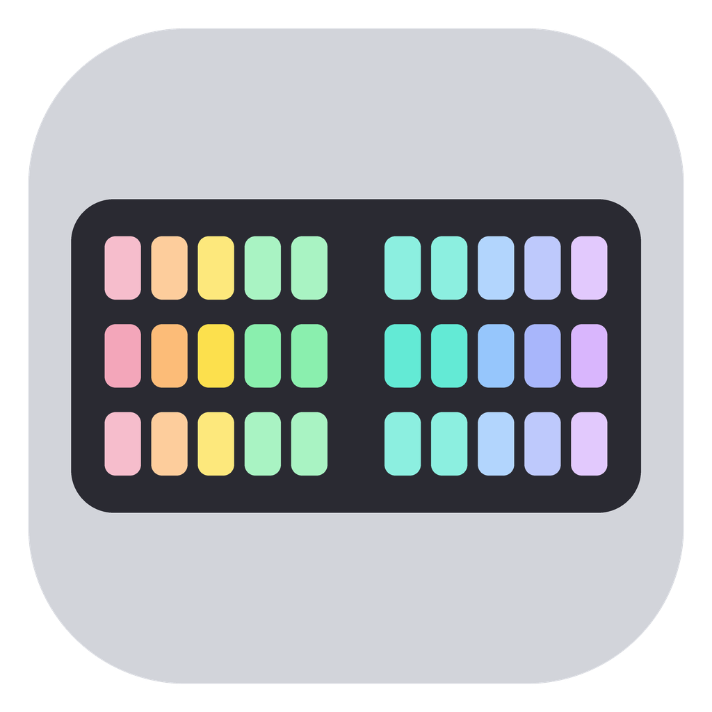
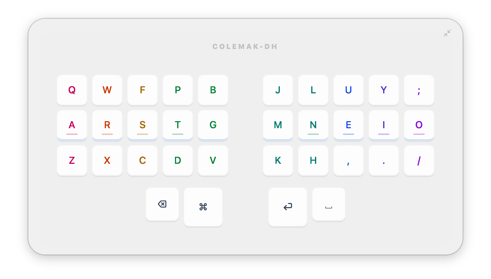
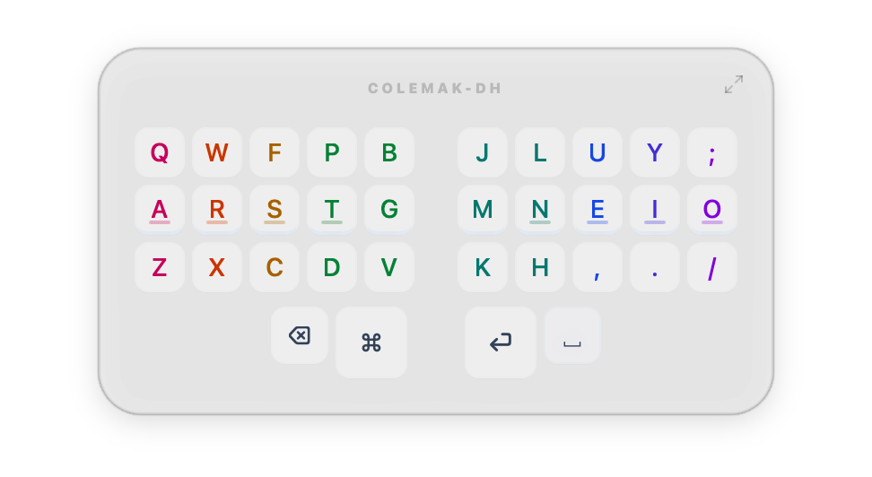
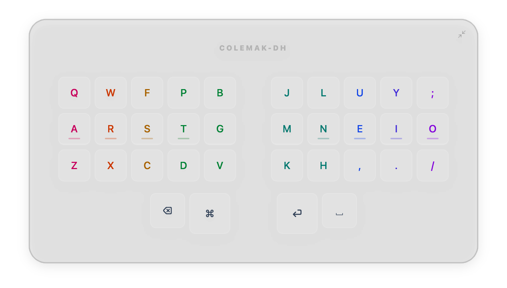
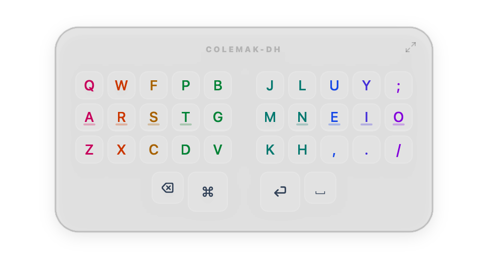

<p align="center">
  
</p>

<h1 align="center">Keyglance</h1>

<p align="center">
  A minimal, always-on-top keyboard overlay that highlights your key presses in real time.<br/>
  Built for touch typists learning a new layout — see which finger should press which key at a glance.
</p>

<p align="center">
  <a href="#features">Features</a> •
  <a href="#screenshots">Screenshots</a> •
  <a href="#supported-keyboard-layouts">Layouts</a> •
  <a href="#installation">Installation</a> •
  <a href="#development">Development</a> •
  <a href="#contributing">Contributing</a> •
  <a href="#license">License</a>
</p>

---

## Screenshots

**Active**

<p>
  
  &nbsp;&nbsp;
  
</p>

**Idle**

<p>
  
  &nbsp;&nbsp;
  
</p>

## Features

- **Real-time key highlighting** — keys light up as you type, showing exactly what you pressed
- **Finger color coding** — each finger is assigned a distinct color so you can quickly see which finger should hit which key
- **Split keyboard view** — matrix (ortholinear) layout with left/right hand split and configurable thumb keys
- **Standard (flat) view** — traditional staggered keyboard layout option
- **Compact & normal sizing** — toggle between a compact overlay and a larger, more readable view
- **Number row** — optionally show/hide the number row
- **Configurable thumb keys** — assign any modifier or key (⌫ ⌘ ⏎ ␣ ⇥ ⎋ ⌦ ⌥ ⌃ ⇧) to thumb positions via a settings panel
- **Always-on-top transparent overlay** — floats above all windows with a frosted-glass aesthetic
- **Auto-follow focused input** — optionally repositions itself above the text field you're typing in
- **Idle fade** — the overlay fades out after 2 seconds of inactivity for a distraction-free experience
- **System tray integration** — switch layouts, toggle matrix mode, number row, and more from the tray menu
- **Launch at login** — optional autostart support
- **Hide dock icon** — run as a menu-bar-only app on macOS
- **Draggable window** — grab and reposition the overlay anywhere on screen
- **Shift layer support** — displays shifted characters when Shift is held
- **Lightweight & native** — built with Tauri 2 (Rust + WebView), minimal resource usage

## Supported Keyboard Layouts

| Layout       | Description                                        |
| ------------ | -------------------------------------------------- |
| **QWERTY**   | The standard layout used by most keyboards          |
| **AZERTY**   | French keyboard layout                              |
| **QWERTZ**   | German/Central European keyboard layout             |
| **Dvorak**   | Simplified Dvorak layout optimised for English      |
| **Colemak**  | Modern alternative layout with minimal key changes   |
| **Colemak-DH** | Colemak mod with improved home-row finger rolls   |

## Installation

### Pre-built binaries

Download the latest release from the [Releases](https://github.com/bn326160/keyglance/releases) page.

> **macOS — "App is damaged" warning**
> Because the app is not code-signed with an Apple Developer certificate, macOS Gatekeeper may block it. After installing, run:
> ```bash
> xattr -cr /Applications/keyglance.app
> ```
> Then open the app again normally.

### Build from source

#### Prerequisites

- [Node.js](https://nodejs.org/) (v18+)
- [Rust](https://www.rust-lang.org/tools/install) (stable)
- [Tauri CLI](https://tauri.app/start/prerequisites/)

```bash
# Clone the repo
git clone https://github.com/brambeirens/keyglance.git
cd keyglance

# Install dependencies
npm install

# Run in development mode
npm run tauri dev

# Build for production
npm run tauri build
```

> **Note:** On macOS, Keyglance requires the **Accessibility** permission to listen for global key events. You will be prompted to grant this on first launch.

## Development

```bash
# Start the Vite dev server + Tauri window
npm run tauri dev
```

### Project Structure

```
keyglance/
├── src/                  # React frontend
│   ├── App.tsx           # Main overlay UI
│   ├── Settings.tsx      # Thumb key settings panel
│   ├── layouts.ts        # Keyboard layout definitions
│   ├── thumbKeys.ts      # Thumb key options & config
│   └── components/
│       └── Keyboard.tsx  # Keyboard renderer
├── src-tauri/            # Rust backend (Tauri)
│   └── src/
│       └── main.rs       # Tray menu, global key listener, window management
├── package.json
├── tsconfig.json
└── vite.config.ts
```

### Tech Stack

- **Tauri 2** — native desktop shell (Rust)
- **React 19** — UI framework
- **TypeScript** — type safety
- **Tailwind CSS 4** — styling
- **Vite 7** — frontend bundling
- **Framer Motion** — animations

## Contributing

Contributions are welcome! Whether it's a bug fix, new keyboard layout, feature request, or documentation improvement — feel free to open a PR.

### How to submit a Pull Request

1. **Fork** the repository
2. **Clone** your fork locally
   ```bash
   git clone https://github.com/<your-username>/keyglance.git
   cd keyglance
   ```
3. **Create a branch** for your change
   ```bash
   git checkout -b feat/my-new-feature
   ```
4. **Make your changes** and test them locally with `npm run tauri dev`
5. **Commit** with a clear, descriptive message
   ```bash
   git commit -m "feat: add Workman keyboard layout"
   ```
6. **Push** to your fork
   ```bash
   git push origin feat/my-new-feature
   ```
7. **Open a Pull Request** against the `main` branch of this repository
   - Provide a clear description of what you changed and why
   - Include screenshots if your change affects the UI
   - Reference any related issues (e.g. `Closes #42`)

### Guidelines

- Keep changes focused — one feature or fix per PR
- Follow the existing code style
- Test your changes on macOS before submitting
- Add new keyboard layouts to `src/layouts.ts` and register the `LayoutId` type

## License

This project is licensed under the **GNU General Public License v3.0** — see the [LICENSE](LICENSE) file for details.

```
Copyright (C) 2026 Bram Beirens

This program is free software: you can redistribute it and/or modify
it under the terms of the GNU General Public License as published by
the Free Software Foundation, either version 3 of the License, or
(at your option) any later version.

This program is distributed in the hope that it will be useful,
but WITHOUT ANY WARRANTY; without even the implied warranty of
MERCHANTABILITY or FITNESS FOR A PARTICULAR PURPOSE. See the
GNU General Public License for more details.
```
